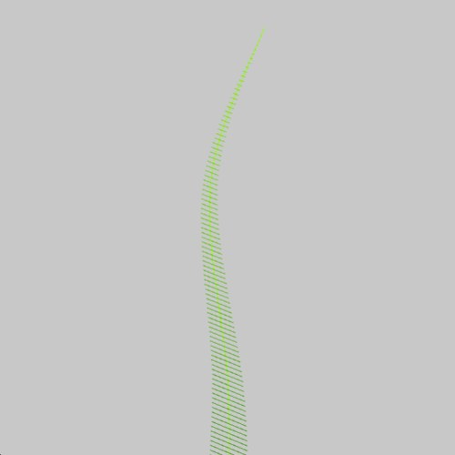
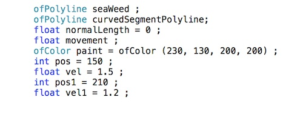
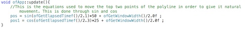
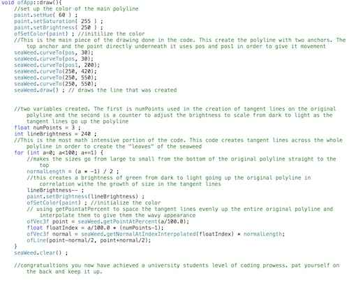

# HW1_SeaWeed - Alex Esposito
This is an experiment of using only polylines and there normals to create a life-like piece of moving seaweed. Using sin and cos as a base for movement the exercise was meant to further solitify an understanding of polylines and Open Frameworks as a whole

The first bit of code to discuss starts in the app.h. These are the variables used throughtout the code.

Next up is back over in the app.cpp where we see the update function doing the math behind the movement of the line.

Lastly is the draw function which is the main course of the seaweed dinner. This is where the polyline and its tangent line "leaves" are made. The colors are all set in here as well in order to create the sea weed shape displayed in the first screen shot. Press run and watch the magic unfold.

